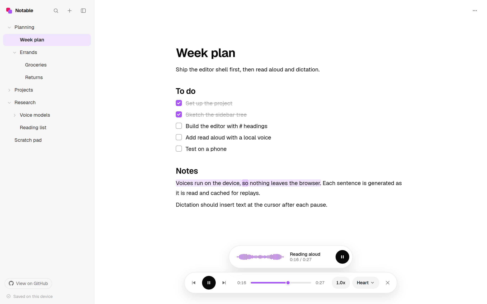
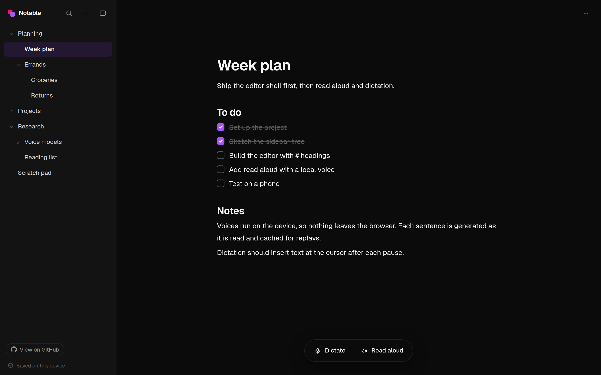
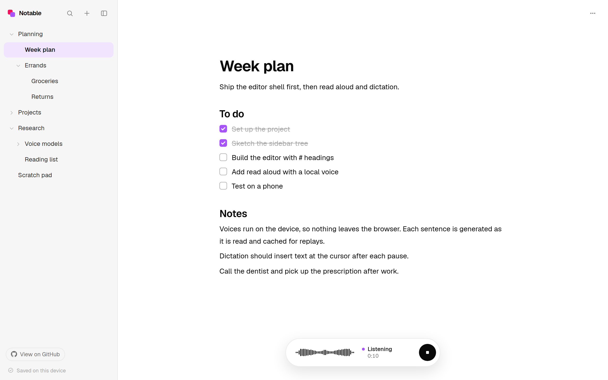
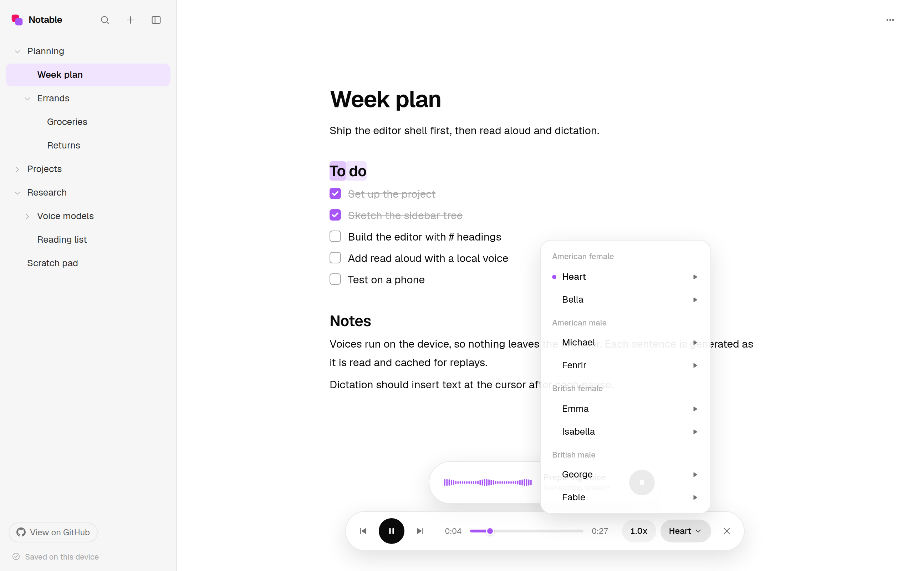
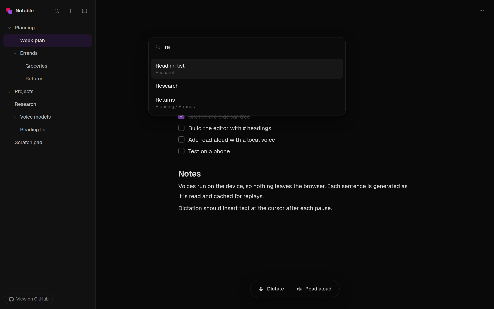

<p align="center">
  
</p>

<h1 align="center">Notable</h1>

<p align="center">
  A free, local-first docs app with dictation, audio transcription, and read aloud that all run on your device.
</p>

<p align="center">
  <a href="https://freenotable.vercel.app/"><strong>https://freenotable.vercel.app</strong></a>
</p>

<p align="center">
  <a href="LICENSE"></a>
  <a href="https://nodejs.org"></a>
  <a href="#offline-and-install"></a>
</p>

## Screenshots

<p align="center">
  
</p>

<table>
  <tr>
    <td width="50%" align="center">
      <br />
      <sub>Notes and checklists in one doc, with nested tabs on the left</sub>
    </td>
    <td width="50%" align="center">
      <br />
      <sub>Dictation types at the cursor after each pause</sub>
    </td>
  </tr>
  <tr>
    <td width="50%" align="center">
      <br />
      <sub>Eight voices grouped by accent and gender, each with a preview</sub>
    </td>
    <td width="50%" align="center">
      <br />
      <sub>Cmd/Ctrl+K searches every doc and unfolds the tree to it</sub>
    </td>
  </tr>
</table>

## What it does

Notable opens straight into the editor and can talk and listen. You keep notes and checklists in the same doc, dictate into it, turn an audio file into text, and have any doc read back to you in a natural voice. The voice models run inside your browser, so there are no accounts, no servers, and no cost per use. Your docs are saved on your device.

- Opens into your last doc, with the tab tree exactly as you left it. A first launch opens one blank doc with the cursor ready.
- Nested tabs to any depth. Fold them, drag them to reorder or nest, double-click to rename, and search them all with Cmd/Ctrl+K.
- Markdown shortcuts as you type: `#`, `##`, `###`, `[]`, `-`, `1.`, plus Cmd/Ctrl+B and Cmd/Ctrl+I.
- Checklists that dim and strike through when checked. Tab and Shift+Tab make sub-tasks.
- Read aloud from the cursor or the selection with Kokoro voices, at 0.75x to 2x.
- Dictation with Whisper that types into the doc after each pause.
- Audio file transcription (mp3, m4a, wav) into a new tab, with optional timestamps.
- Export to Markdown, Word, or PDF, or download every doc at once as a zip.
- Works offline after the first visit, and can be installed from the browser as a desktop app.
- Built for computers. Phones and tablets see a short notice instead of the app.

## How it works

### Editor and tabs

The editor is [Tiptap](https://tiptap.dev) on top of ProseMirror. StarterKit handles headings, lists, and the inline marks. The checklist trigger comes from Tiptap's task item input rule, which already accepts `[] ` as well as `[ ] `.

Each doc is stored as Tiptap JSON. Tabs are stored flat, each with a parent id and an order, so moving a tab only rewrites the rows that changed. All tree changes go through small pure functions in `src/features/tabs/lib/tree.ts`, which also refuse to drop a tab into its own subtree. A tab's title comes from the first line of its doc until you rename it.

Every doc gets its own editor instance when you switch to it. That keeps undo history per doc instead of letting it leak across tabs.

### Read aloud

1. The doc is walked block by block and split into sentences with `Intl.Segmenter`. Each sentence keeps its exact position in the doc. Because the text comes from the editor tree rather than from Markdown, there are no symbols to skip, and checklist items read as plain text.
2. Kokoro-82M runs in a Web Worker through [kokoro-js](https://github.com/hexgrad/kokoro). It generates one sentence at a time. Playback starts as soon as the first sentence is ready, and the next two generate in the background.
3. Every clip is stored in IndexedDB, keyed by voice and text. Replays, scrubbing back, and re-reading an unchanged doc never touch the model.
4. Clips play through one `<audio>` element. That element feeds a Web Audio analyser for the popup bars and is hooked up to Media Session, so lock screens and media keys can control it.
5. Word timing is estimated by splitting each sentence's audio length by character count. The highlight is drawn with ProseMirror decorations, so it never ends up in the saved doc.
6. Clicking a word, or dragging the timeline, jumps there. A sentence that is not ready yet is generated first.

If Kokoro cannot load at all, Notable reads with the browser's built-in `speechSynthesis` voice instead.

### Dictation and transcription

Both use Whisper through [Transformers.js](https://huggingface.co/docs/transformers.js) in a second worker. "Fast" is `whisper-tiny.en` (about 40 MB) and "Accurate" is `whisper-base.en` (about 80 MB). Pick one from the doc menu.

For dictation, an AudioWorklet copies raw microphone samples off the audio thread. A pause segmenter compares each chunk's loudness to a slowly tracked noise floor. After about a second of quiet following speech, it cuts a segment, resamples it to 16 kHz, and queues it for Whisper. Segments are transcribed in order and inserted at the cursor. After three seconds with no speech, the popup says it can't hear you. Common phantom outputs for silence, like `[BLANK_AUDIO]`, are dropped.

For files, the audio is decoded with the Web Audio API, mixed to mono, resampled to 16 kHz, and transcribed in 30 second windows so progress is real. The result opens in a new tab.

### Glass voice popup

The popup is one presentational component. Dictation, transcription, and read aloud each map their own state onto it: listening, can't hear you, transcribing, preparing, reading, downloading, or an error with a retry. A canvas draws 40 bars each animation frame from the analyser data, eased so they glide. With reduced motion turned on in the OS, the bars become a plain level meter.

### Models and compute

Each model downloads once, with a progress bar, and Transformers.js keeps it in the browser cache. WebGPU is used when the browser can provide an adapter, otherwise WASM. Kokoro uses full precision weights on WebGPU and 8-bit weights on WASM.

If the browser reports a cellular connection (a tethered laptop, for example), the first download of each model asks before starting.

### Storage and export

Docs, the tab tree, and settings live in IndexedDB through [Dexie](https://dexie.org). Saves happen about 500 ms after you stop typing and are flushed when you switch tabs or close the page. Notable also asks the browser for persistent storage. Generated audio sits in a separate database, so "Clear audio cache" never touches your text.

- **Markdown** is written by hand from the doc JSON, with checklists as `- [ ]` and `- [x]`.
- **Word** files are built in the browser with the [docx](https://docx.js.org) library, using real Word headings, lists, and checkboxes.
- **PDF** uses a print-friendly layout and the browser's print dialog, so the text stays selectable.
- **Export all** downloads a zip of Markdown files laid out in folders that match the tab tree. Local docs vanish if browser data is cleared, so this is your backup.

### Offline and install

A small service worker caches the app shell and the ONNX runtime files, so Notable works offline after the first visit. Worker scripts skip that cache on purpose: Turbopack starts every worker from one shared script and passes the chunk list in the URL fragment, which the Cache API ignores. The manifest lets browsers install Notable as a desktop app, and browsers are less likely to clear storage for installed apps.

Notable is built for computers. A device whose main input is a finger (a phone or tablet) gets one line saying so, and the app, its models, and its storage are never loaded there.

## Tech stack

- Next.js 16 with the App Router and TypeScript
- Tailwind CSS 4
- Tiptap 3 (ProseMirror)
- Zustand for state
- Dexie for IndexedDB
- kokoro-js for text to speech
- Transformers.js for Whisper speech to text
- Web Audio API, AudioWorklet, and Media Session
- docx and fflate for exports
- Vitest for tests

## Project structure

```
src/
  app/                  Next.js entry: layout, page, manifest, icons
  components/
    icons/              Line icons, the logo mark, and the GitHub mark
    ui/                 Buttons, the glass popover, menu items, the confirm dialog
  features/
    audio/              Shared AudioContext, resampling, WAV encoding, level math
    dictation/          Mic capture, pause segmenter, dictation controller and popup
    doc-menu/           The menu for export, transcription, and voice settings
    editor/             Tiptap setup, autosave, editor styles
    export/             Markdown, Word, PDF, and zip export
    models/             The "download on cellular?" prompt
    read-aloud/         Kokoro worker and engine, sentence player, highlight, playback UI
    storage/            IndexedDB schema and repository
    switcher/           The Cmd/Ctrl+K quick switcher
    tabs/               Tab tree logic, store, persistence, sidebar rows
    transcription/      Audio file decoding, 30 second windows, transcript docs
    voice-dock/         Bottom-center voice buttons and popups
    voice-popup/        The shared glass popup and its canvas bars
    whisper/            Whisper worker, engine, and model settings
    workspace/          App shell: sidebar, drawer, top bar, shortcuts, boot
  lib/                  Small shared helpers and the typed worker RPC
assets/
  brand/                The Notable logo artwork
public/
  sw.js                 Offline service worker
  worklets/             The microphone capture AudioWorklet
```

Pure logic sits in `lib` folders next to the feature that uses it and has tests beside it.

## Getting started

You need Node.js 20 or newer. The project is developed on Node 22.

```bash
git clone https://github.com/edison16a/notable.git
cd notable
npm install
npm run dev
```

Open http://localhost:3000. The first time you use read aloud or dictation, the model downloads (about 90 MB for the voice, 40 or 80 MB for speech recognition). After that it loads from the browser cache and works offline.

Chrome and Edge give the best performance because they support WebGPU. Safari and Firefox run the models on WASM, which is slower but works.

| Command | What it does |
| --- | --- |
| `npm run dev` | Starts the dev server |
| `npm run build` | Makes a production build |
| `npm start` | Serves the production build |
| `npm test` | Runs the Vitest suite |
| `npm run lint` | Runs ESLint |
| `npm run typecheck` | Runs the TypeScript compiler |

The `.npmrc` skips the native `onnxruntime-node` download that Transformers.js pulls in, because Notable only runs models in the browser.

To deploy your own copy, import the repo into [Vercel](https://vercel.com). There are no environment variables and no backend.

## Keyboard shortcuts

| Keys | Action |
| --- | --- |
| Cmd/Ctrl+K | Search docs |
| Cmd/Ctrl+\ | Show or hide the sidebar |
| Alt+N | New tab |
| Alt+Shift+N | New subtab inside the current tab |
| Double-click a tab, or F2 | Rename it |
| Esc | Stop dictation or reading |

Browsers reserve Cmd/Ctrl with T, W, and N, so tab actions use Alt.

## Decisions on the open questions

- **Deleting a tab with subtabs** deletes the subtabs too, after a confirmation that says how many there are.
- **`[]` as the checklist trigger** works, and so does `[ ]`.
- **Browser speech recognition fallback** is left out. Chrome sends that audio to a server, which breaks the promise that nothing leaves the device.
- **Languages** are English only in v1, using the English Whisper checkpoints.
- **Theme** follows the system setting, light or dark.

## License

Notable is released under the [MIT License](LICENSE).
